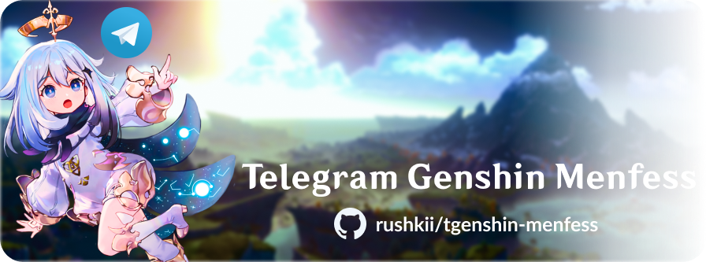
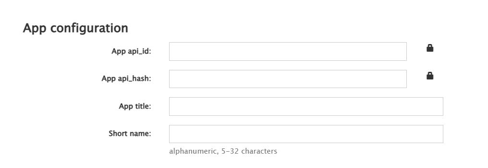

<h1 align="center">Telegram Genshin Menfess</h1>


**Telegram Genshin Menfess** is a Telegram bot for posting user's [menfess](https://qr.ae/pvb9pX) into a channel that related to **Genshin Impact**


Table of Contents
=================
- [Installations](#installations)
- [Setup Environments](#setup-environments)
- [How To Run](#how-to-run-it)
- [Fanarts Source Credits](#fanarts-source-credits)


Installations
=============

<details>
    <summary><b>Python 3.8+</b></summary>
    <ul>
        <li><a href="https://www.python.org/downloads/release/python-383/">Download for Windows</a></li>
        <li>
            <a href="https://www.python.org/downloads/release/python-383/">Install for Linux</a>
            <pre>sudo apt update
sudo apt upgrade
sudo apt install python3.8</pre>
        </li>
    </ul>
</details>

<details>
    <summary><b>Required Packages</b></summary>
    <pre>python3 -m pip install -r requirements.txt</pre>
</details>

Setup Environments
===========
Setup a **.env file**, you can see the example of env variables in the .**env-example**.

<details>
    <summary><b>Telegram API Credentials (API ID & API HASH)</b></summary>
    
    You can get them by creating API apps <a href="https://my.telegram.org/apps">here</a>.
    <pre>API_ID=123123
API_HASH=abcdEFgHiJkl</pre>
</details>

<details>
    <summary><b>Telegram Bot API Token (BOT TOKEN)</b></summary>
    You can get them by creating your own bot in <a href="https://t.me/botfather">@BotFather</a>.
    <pre>BOT_TOKEN=123123:abcdeFGHIJKL</pre>
</details>

<details>
    <summary><b>Telegram Channel</b></summary>
    To use this program, you must have a Telegram channel.<br/>
    You can create it in the Telegram app, once you created it copy the channel username in the .env file and paste to CHANNEL_USERNAME variable.
</details>

<details>
    <summary><b>MongoDB URI</b></summary>
    You can run MongoDB in your local machine.<br>
    <a href="https://www.mongodb.com/docs/manual/tutorial/install-mongodb-on-windows/">Install MongoDB on Windows</a> | <a href="https://www.mongodb.com/docs/manual/tutorial/install-mongodb-on-ubuntu/">Install MongoDB on Ubuntu</a>
</details>

<details>
    <summary><b>MongoDB Database Name</b></summary>
    You can name everything for your MongoDB Database in the .env file.
</details>

<details>
    <summary><b>Finish</b></summary>
    Once all variables are sets, rename the <b>.env-example</b> to <b>.env</b>.
</details>

How To Run It?
===========

```python
# main.py

import os
import asyncio
from pyrogram import idle
from dotenv import load_dotenv
from motor.motor_asyncio import AsyncIOMotorClient

from menfess import GenshinMF, MongoDB


async def main():
	load_dotenv()
	conn = AsyncIOMotorClient(os.getenv("MONGO_URI"))
	mongo = MongoDB(conn)
	await mongo.init()

	bot = GenshinMF(
		name="Piemon",
		api_id=int(os.getenv("API_ID")),
		api_hash=os.getenv("API_HASH"),
		bot_token=os.getenv("BOT_TOKEN"),
		plugins=dict(root="menfess.bot.plugins"),
		mongo=mongo
	)
	await bot.start()
	await idle()
	await bot.stop()


if __name__ == "__main__":
	asyncio.run(main())

```

Save the script above as **main.py**, then start a MongoDB service, then run it by `python3 main.py`.

Fanarts Source Credits
======================
- [Paimon](https://transxiao.tumblr.com/post/634834181982224384/p-a-i-m-o-n-official-art-used-on-the-cn-genshin)
- [Teyvat Background Image](https://www.reddit.com/r/Genshin_Impact/comments/sm6h1n/a_view_of_teyvat/)
